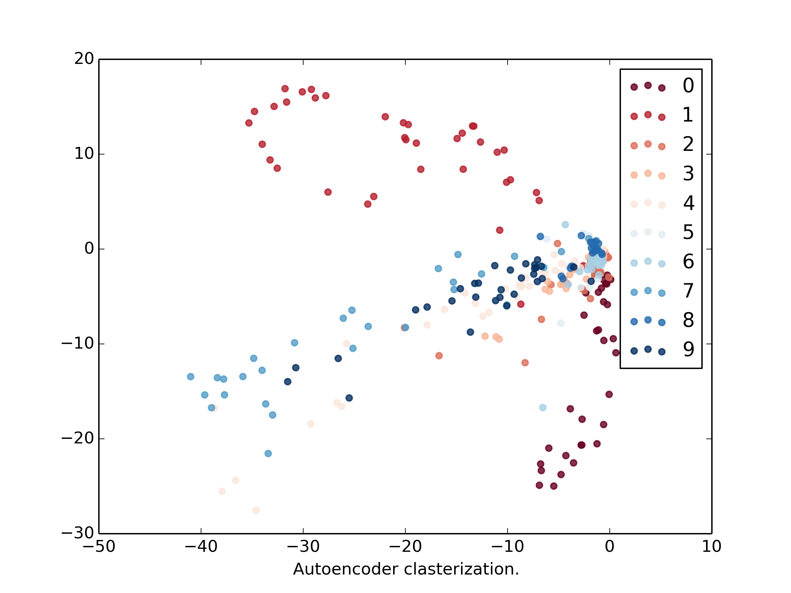
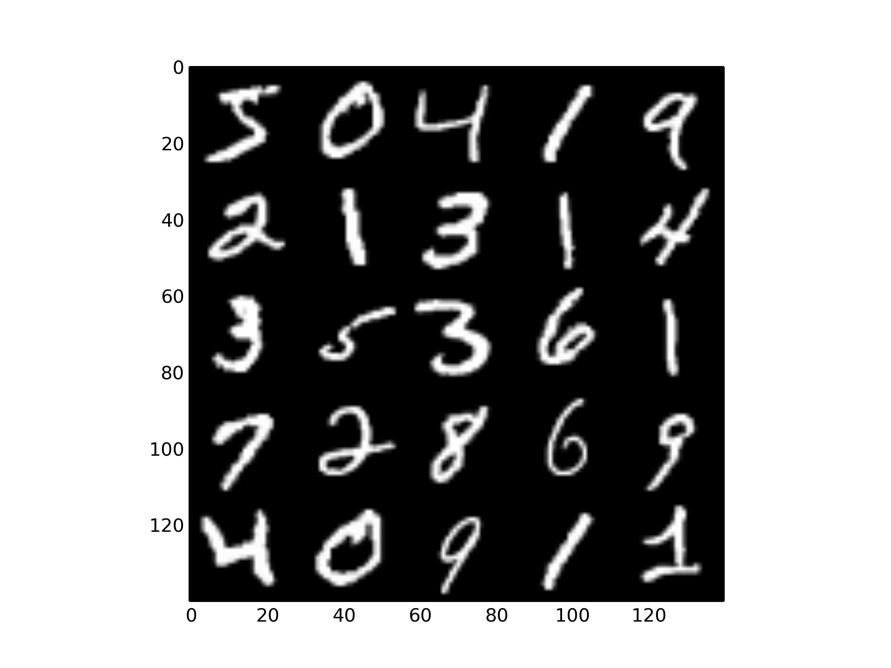
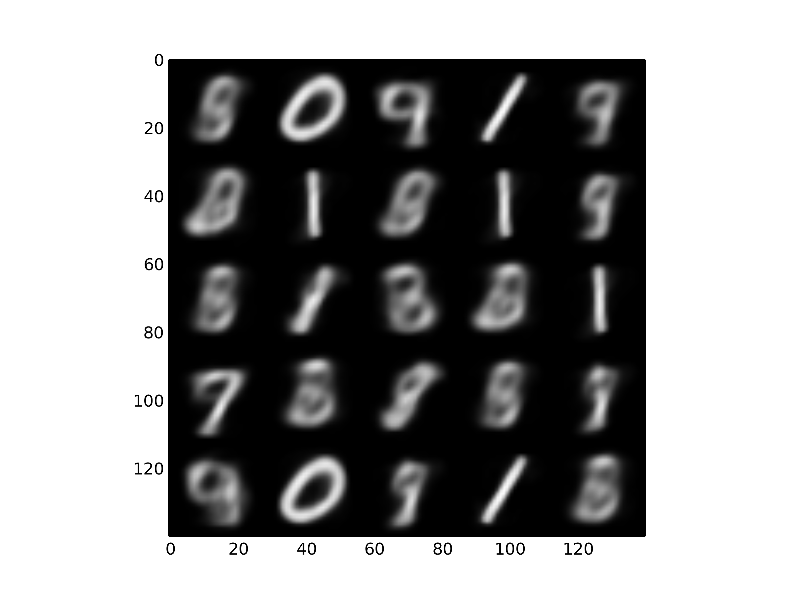

# Simple Autoencoder

<p align="center">

</p>

<p align="center">


</p>

This directory builds a simple autoencoder model.

**Note:** This model is a work in progress and training doesn't quite work.
Specific areas for improvement are listed at the top of `Autoencoder.swift`.

## Setup

To begin, you'll need the [latest version of Swift for
TensorFlow](https://github.com/tensorflow/swift/blob/master/Installation.md)
installed. Make sure you've added the correct version of `swift` to your path.

To train the model, run:

```
swift -O Autoencoder.swift
```
If you using brew to install python2 and modules, change the path:
 - remove brew path '/usr/local/bin'
 - add TensorFlow swift Toolchain /Library/Developer/Toolchains/swift-latest/usr/bin

```
export PATH=/Library/Developer/Toolchains/swift-latest/usr/bin:/usr/bin:/bin:/usr/sbin:/sbin
``` 
