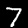
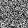

# 1D Variational Autoencoder

This is an example of a simple 1-dimensional Variational Autoencoder model, using MNIST as a training dataset. Variational Autoencoder is based on the paper: "Auto-Encoding Variational Bayes", [Kingma et. al](https://arxiv.org/abs/1312.6114). It should produce output similar to the following:

### Epoch 1
<p align="center">


</p>

### Epoch 10
<p align="center">


</p>


## Setup

To begin, you'll need the [latest version of Swift for
TensorFlow](https://github.com/tensorflow/swift/blob/master/Installation.md)
installed. Make sure you've added the correct version of `swift` to your path.

To train the model, run:

```
swift run -c release VariationalAutoencoder1D
```

## Key implementations

1. Reparamterization trick is internally implemented in the VAE model
2. VAE model returns an `Array` of `Tensor<Float>` tensors - which is inherently a `Differentiable` extension. (Reference: [S4TF API Docs](https://www.tensorflow.org/swift/api_docs/Extensions/Array)) 
3. Loss Function combines `sigmoidCrossEntropy` of the output and KL Divergence between the intermediate representations. 
