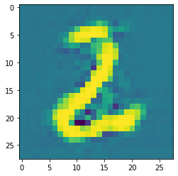

# Deep Convolutional Generative Adversarial Network 

arXiv: https://arxiv.org/abs/1406.2661

After 10 epochs:
<p align="center">
  
</p>

## Tutorial

You can read the tutorial on creating this model [here](https://rickwierenga.com/blog/s4tf/s4tf-gan.html) (rickwierenga.com).

## Setup

To begin, you'll need the [latest version of Swift for
TensorFlow](https://github.com/tensorflow/swift/blob/main/Installation.md)
installed. Make sure you've added the correct version of `swift` to your path.

To train the model, run:

```sh
swift run DCGAN
```
