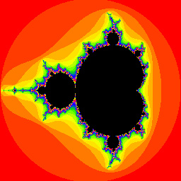
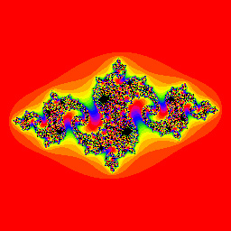

# Fractal image generation

This example illustrates how to generate images of different types of fractals and save them to disk. All key
parameters can be specified at the command line, to produce a variety of views and imagery. 

Internally, calculations are performed using the Tensor type, allowing for efficient parallel computation. Both
eager-mode and X10 backends are supported, demonstrating how to perform parallel calculations on the CPU or
various accelerators.

Size and region values are comma-separated.


## Generating the Mandelbrot set

To calculate an image of the Mandelbrot set with default parameters, you can simply run

```sh
swift run -c release Fractals MandelbrotSet
```

This will save out a resulting image in the local file `mandelbrot.jpg` that will look something like the following:

<p align="center">

</p>

A number of parameters can be customized at the command line to look at different regions of the fractal, or
otherwise change how it is calculated or rendered. Here's an example that explicitly specifies all the
parameters, and has the calculation run via XLA on the default accelerator using the X10 backend:

```sh
swift run -c release Fractals MandelbrotSet --iterations 200 --tolerance 4.0 --region=-2.0,1.0,-1.3,1.3 --image-size 256,256 --x10 --output-file mandelbrot 
```

The relevant parameters are:

- `iterations`: The number of iterations of the Z * Z + X calculation to perform. 
- `tolerance`: The threshold for which divergence of the calculation is determined. 
- `region`: A comma-separated list corresponding to the region `real_minimum`, `real_maximum`, `imaginary_minimum`, `imaginary_maximum`.
- `image-size`: The size of the resulting image, specified as the comma-separated pair `width`, `height`.
- `x10` or `eager`: Whether to use the eager-mode backend (default) or the X10 backend for the calculations.
- `output-file`: The base name of the image file to write out.

## Generating the Julia set

```sh
swift run -c release Fractals JuliaSet
```

This will save out a resulting image in the local file `julia.jpg` that will look something like the following:

<p align="center">

</p>

As with the Mandelbrot set above, many relevant parameters for creating an image of the Julia set can be specified at
the command line. Here's an example that explicitly specifies all the parameters, and has the calculation run via XLA
on the default accelerator using the X10 backend:

```sh
swift run -c release Fractals JuliaSet --constant=-0.8,0.156 --iterations 200 --tolerance 4.0 --region=-1.7,1.7,-1.7,1.7 --image-size 256,256 --x10 --output-file julia 
```
The relevant parameters are:

- `constant`: The constant C, specified as a comma-separated pair of `real`, `imaginary`. 
- `iterations`: The number of iterations of the Z * Z + C calculation to perform. 
- `tolerance`: The threshold for which divergence of the calculation is determined. 
- `region`: A comma-separated list corresponding to the region `real_minimum`, `real_maximum`, `imaginary_minimum`, `imaginary_maximum`.
- `image-size`: The size of the resulting image, specified as the comma-separated pair `width`, `height`.
- `x10` or `eager`: Whether to use the eager-mode backend (default) or the X10 backend for the calculations.
- `output-file`: The base name of the image file to write out.
