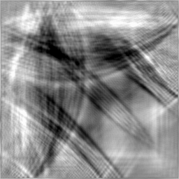

# Differentiable Shallow Water PDE Solver

This example contains source code of a shallow water partial differential equation (PDE) solver. The solver is written in differentiable Swift which allows end-to-end propagation of derivatives through time. In physics this kind of solution is traditionally called adjoint and it unlocks a new class of algorithms for optimal control of PDEs.

More details about the PDE and how to derive it from general Navier-Stokes equations can found for example on [Wikipedia](https://en.wikipedia.org/wiki/Shallow_water_equations).

The code is re-implemented from the [DiffTaichi paper](https://arxiv.org/abs/1910.00935), in particular the [`wave.py`](https://github.com/yuanming-hu/difftaichi/blob/master/examples/wave.py) problem. The main goal is to provide a benchmark of differentiable Swift against the DiffTaichi framework.


## Splash in a Bathtub

The following code builds and runs a demo simulation of a water surface behavior in a rectangular bathtub. There's an initial "splash" at the beginning that drives the simulation. The splash generates surface gravity waves that propagate away from the center and reflect off the domain walls.


```sh
# Make sure you run the example from this directory
cd swift-models/Examples/Shallow-Water-PDE

# Build and run the example app with the splash flag
swift run -c release Shallow-Water-PDE --splash

# Create animation and remove the intermediate files
convert Images/Splash-*.jpg Images/Splash.gif
rm Images/Splash-*.jpg
```


## Optimization of Initial Water Level

The following example takes advantage of the end-to-end differentiability of the PDE solution and optimizes the initial condition. The initial condition is the water surface height used to start the simulation. The goal, a very tricky one from the perspective of optimal control theory, is to achieve specific wave pattern when the simulation terminates.

The goal is represented by a MSE cost function that measures difference between the terminal water level and a target picture. Optimization procedure itself is a simple gradient descent that adjust the initial water surface height to achieve smaller cost after every iteration.



```sh
# Make sure you run the example from this directory
cd swift-models/Examples/Shallow-Water-PDE

# Build and run the example app with the optimization flag
swift run -c release Shallow-Water-PDE --optimization

# Create animation and remove the intermediate files
convert Images/Optimization-*.jpg Images/Optimization.gif
rm Images/Optimization-*.jpg
```


## Benchmark of 3 Solver Implementations

Solution of the shallow water hyperbolic PDE is calculated with finite-difference discretization on unit square. Time-stepping uses semi implicit Euler's schema. Time step itself is limited to stay below the Courant–Friedrichs–Lewy numerical stability limit. Values around the edges of the domain are subject to trivial Dirichlet boundary conditions - i.e. they're equal to zero with an arbitrary normal derivative.

The bread and butter of the solver is the Laplace operator. Its evaluation is the bulk of the execution time. This particular implementation approximates the laplacian with five-point stencil finite-differencing.

The example application contains 3 different implementations of the algorithm described above. The key difference is the underlying data storage of the discretized Laplace operator.

- **A** - [`ArrayLoopSolution.swift`](ArrayLoopSolution.swift): Uses `[[Float]]` for storage. Calculations are done in a tight 2D loop.
- **B** - [`TensorLoopSolution.swift`](TensorLoopSolution.swift): Uses `Tensor` for storage. Calculations are done in a tight 2D loop.
- **C** - [`TensorSliceSolution.swift`](TensorSliceSolution.swift): Uses arithmetic operations on slices of `Tensor` and no loops.

**A** and **B** are written in an imperative style that is very close to DiffTaichi. These are therefore the two most representative candidates for benchmarking. **C** was written more or less out of desperation from bugs encountered while working on **A** and **B**. It uses arithmetics on tensor slices in place of the 2D loops.

From the perspective of computer vision, the discretized Laplace operator can be viewed as a convolution or also a special type of a Gaussian blur operation. It uses a fixed 3x3 single channel weight matrix and operates on a 2D greyscale image. Shades of gray in this case represent the height of the water surface.

In some sense, solutions **A** and **B**  reimplement convolution from scratch using loops. From the performance perspective, this is a very bad idea. The problem here is that not all discretizations of the laplacian can be written as a convolution. So this benchmark has some relevance for these alternative discretizations that operate on unstructured meshes. Typical examples of this is FVM (finite volume method) or FEM (finite element method).

The following code is the result of running the benchmark.

```sh
# Build and run the example app with the benchmark flag
swift run -c release Shallow-Water-PDE --benchmark
```
```
running Shallow Water PDE Solver: Array Loop... done! (56600.83 ms)
running Shallow Water PDE Solver: Tensor Slice... done! (984.77 ms)
running Shallow Water PDE Solver: Tensor Slice (XLA)... done! (2348.76 ms)

name                                             time              std        iterations warmup       
---------------------------------------------------------------------------------------------------
Shallow Water PDE Solver.Array Loop             4703759125 ns ±   0.23 %         10 9527037330 ns
Shallow Water PDE Solver.Tensor Slice             78721300 ns ±   8.86 %         10  164568993 ns
Shallow Water PDE Solver.Tensor Slice (XLA)      145653698 ns ±   4.02 %         10  882607424 ns
```

As of S4TF toolchain 0.10 there's **no conclusion** from the benchmarks yet. The plan is to revisit the project again when the differentiability of coroutines is working. In particular, at the moment it's not possible to differentiate through indexed assignments like `anArray[i] = someVal`. Progress on these issues is tracked under the following links:

- [`https://bugs.swift.org/browse/TF-1078`](https://bugs.swift.org/browse/TF-1078)
- [`https://bugs.swift.org/browse/TF-1080`](https://bugs.swift.org/browse/TF-1080)
