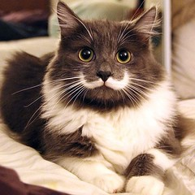
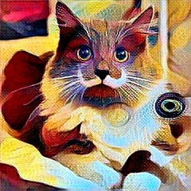
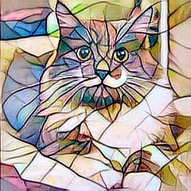

# Fast Style Transfer

Based on the [PyTorch implementation](https://github.com/pytorch/examples/tree/master/fast_neural_style).
The model should be trainable, but so far it's only tested for inference with pre-trained weights (included in `Demo/weights`). 

## Example
Run demo application to apply styles to jpeg images:
```
swift run FastStyleTransferDemo --style=candy --image=FastStyleTransfer/Demo/examples/cat.jpg --output=candy_cat.jpg
swift run FastStyleTransferDemo --style=mosaic --image=FastStyleTransfer/Demo/examples/cat.jpg --output=mosaic_cat.jpg
```





## Jupyter Notebook
Run [demo notebook](Demo/ColabDemo.ipynb) in [Colab](https://colab.research.google.com/github/vvmnnnkv/swift-models/blob/fast-style/FastStyleTransfer/Demo/ColabDemo.ipynb)!
