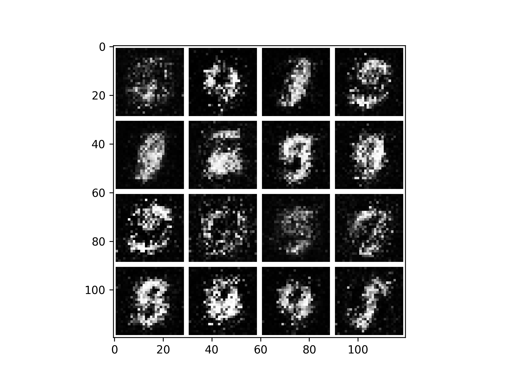
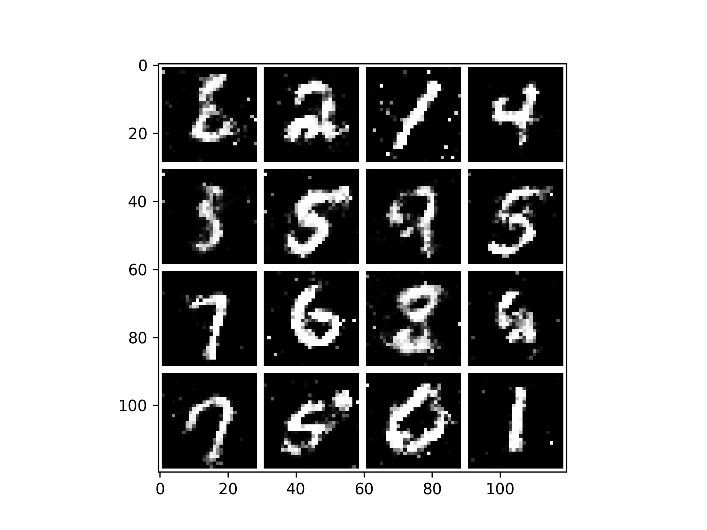

# Simple GAN

After Epoch 1:
<p align="center">

</p>

After Epoch 10:
<p align="center">

</p>

## Setup

To begin, you'll need the [latest version of Swift for
TensorFlow](https://github.com/tensorflow/swift/blob/master/Installation.md)
installed. Make sure you've added the correct version of `swift` to your path.

To train the model, run:

```sh
swift run GAN
```